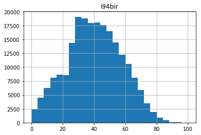
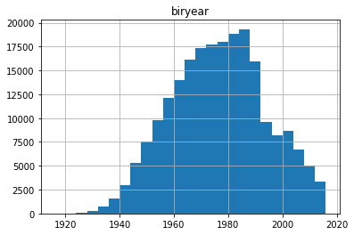
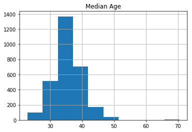
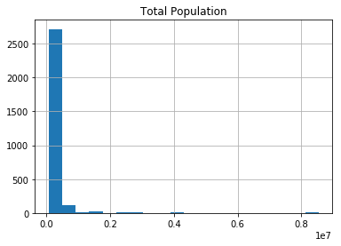
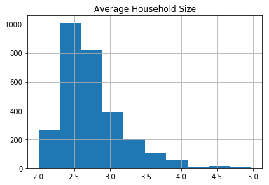
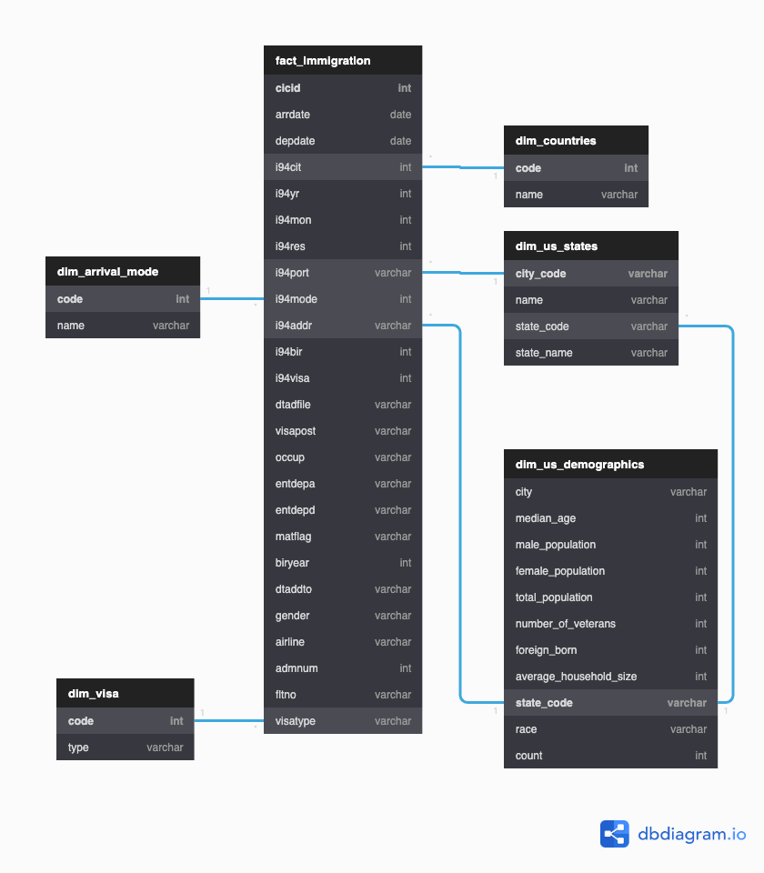

# Udacity Data Engineering NanoDegree
### Data Engineering Capstone Project

#### Project Summary

The Use Case for this exercise is the creation of a highly **scalable Data Pipeline and Data WareHousing** for the investigation and extraction of insights related to the immigration of people to US, via Land, Air or Sea channels. The target audience are Immigration, Security or Health departments, which may want to apply analytics to this data to gain a better understanding of national migration patterns, distributions or cycles.

The project follows the follow steps:
* Step 1: Scope the Project and Gather Data
* Step 2: Explore and Assess the Data
* Step 3: Define the Data Model
* Step 4: Run ETL to Model the Data
* Step 5: Complete Project Write Up

__________

### Step 1: Scope the Project and Gather Data

#### Scope 
This project aims at providing an automated pipeline for the Extraction, Transformation and Loading (ETL) of the [I94_SAS Immigration Dataset (2016)](https://travel.trade.gov/research/reports/i94/historical/2016.html), enriched with [US City Demographic](https://public.opendatasoft.com/explore/dataset/us-cities-demographics/export/) and other ancillary data (I94_SAS_Labels_Descriptions.SAS)

The main dataset is coming from the US National Tourism and Trade Office repository, which is cleaned and enriched with additional information, to further be compressed and organized on a Data WareHouse for future querying and application of analytics by Immigration, Security or Health departments.

#### General Architecture/ Tech Stack


------------

### Step 2: Explore and Assess the Data
#### Explore the Data 
Identify data quality issues, like missing values, duplicate data, etc.

#### Cleaning Steps
Document steps necessary to clean the data. Data sets 
- **1) I94 Immigration Data** 
- and **2) U.S. City Demographic Data**


```python
# Do all imports and installs here
import pandas as pd
from pyspark.sql import functions as f
import datetime as dt
from pyspark.sql import SparkSession
from pyspark.sql.types import IntegerType
```

**1) I94 Immigration Data:** Is the main dataset, coming from the US National Tourism and Trade Office. It's partitioned by months for the year 2016, available from the `../../data/18-83510-I94-Data-2016/` directory. Altogether, the 12 files for 2016 have over 40 million rows, with 28 fields.


```python
# Read in the data here
df_immigration = '../../data/18-83510-I94-Data-2016/i94_apr16_sub.sas7bdat'
df_imm = pd.read_sas(df_immigration, 'sas7bdat', encoding="ISO-8859-1")
```


```python
df_imm.head()
```


<div>
<style scoped>
    .dataframe tbody tr th:only-of-type {
        vertical-align: middle;
    }

    .dataframe tbody tr th {
        vertical-align: top;
    }

    .dataframe thead th {
        text-align: right;
    }
</style>
<table border="1" class="dataframe">
  <thead>
    <tr style="text-align: right;">
      <th></th>
      <th>cicid</th>
      <th>i94yr</th>
      <th>i94mon</th>
      <th>i94cit</th>
      <th>i94res</th>
      <th>i94port</th>
      <th>arrdate</th>
      <th>i94mode</th>
      <th>i94addr</th>
      <th>depdate</th>
      <th>...</th>
      <th>entdepu</th>
      <th>matflag</th>
      <th>biryear</th>
      <th>dtaddto</th>
      <th>gender</th>
      <th>insnum</th>
      <th>airline</th>
      <th>admnum</th>
      <th>fltno</th>
      <th>visatype</th>
    </tr>
  </thead>
  <tbody>
    <tr>
      <th>0</th>
      <td>6.0</td>
      <td>2016.0</td>
      <td>4.0</td>
      <td>692.0</td>
      <td>692.0</td>
      <td>XXX</td>
      <td>20573.0</td>
      <td>NaN</td>
      <td>NaN</td>
      <td>NaN</td>
      <td>...</td>
      <td>U</td>
      <td>NaN</td>
      <td>1979.0</td>
      <td>10282016</td>
      <td>NaN</td>
      <td>NaN</td>
      <td>NaN</td>
      <td>1.897628e+09</td>
      <td>NaN</td>
      <td>B2</td>
    </tr>
    <tr>
      <th>1</th>
      <td>7.0</td>
      <td>2016.0</td>
      <td>4.0</td>
      <td>254.0</td>
      <td>276.0</td>
      <td>ATL</td>
      <td>20551.0</td>
      <td>1.0</td>
      <td>AL</td>
      <td>NaN</td>
      <td>...</td>
      <td>Y</td>
      <td>NaN</td>
      <td>1991.0</td>
      <td>D/S</td>
      <td>M</td>
      <td>NaN</td>
      <td>NaN</td>
      <td>3.736796e+09</td>
      <td>00296</td>
      <td>F1</td>
    </tr>
    <tr>
      <th>2</th>
      <td>15.0</td>
      <td>2016.0</td>
      <td>4.0</td>
      <td>101.0</td>
      <td>101.0</td>
      <td>WAS</td>
      <td>20545.0</td>
      <td>1.0</td>
      <td>MI</td>
      <td>20691.0</td>
      <td>...</td>
      <td>NaN</td>
      <td>M</td>
      <td>1961.0</td>
      <td>09302016</td>
      <td>M</td>
      <td>NaN</td>
      <td>OS</td>
      <td>6.666432e+08</td>
      <td>93</td>
      <td>B2</td>
    </tr>
    <tr>
      <th>3</th>
      <td>16.0</td>
      <td>2016.0</td>
      <td>4.0</td>
      <td>101.0</td>
      <td>101.0</td>
      <td>NYC</td>
      <td>20545.0</td>
      <td>1.0</td>
      <td>MA</td>
      <td>20567.0</td>
      <td>...</td>
      <td>NaN</td>
      <td>M</td>
      <td>1988.0</td>
      <td>09302016</td>
      <td>NaN</td>
      <td>NaN</td>
      <td>AA</td>
      <td>9.246846e+10</td>
      <td>00199</td>
      <td>B2</td>
    </tr>
    <tr>
      <th>4</th>
      <td>17.0</td>
      <td>2016.0</td>
      <td>4.0</td>
      <td>101.0</td>
      <td>101.0</td>
      <td>NYC</td>
      <td>20545.0</td>
      <td>1.0</td>
      <td>MA</td>
      <td>20567.0</td>
      <td>...</td>
      <td>NaN</td>
      <td>M</td>
      <td>2012.0</td>
      <td>09302016</td>
      <td>NaN</td>
      <td>NaN</td>
      <td>AA</td>
      <td>9.246846e+10</td>
      <td>00199</td>
      <td>B2</td>
    </tr>
  </tbody>
</table>
<p>5 rows × 28 columns</p>
</div>


However, as can be seen, not all fields contain the same amount of data and files such as **occup, entdepu,** and **insnum** are very sparse. Something that we'll have to take care of during data preparation


```python
df_imm.count()
```


    cicid       3096313
    i94yr       3096313
    i94mon      3096313
    i94cit      3096313
    i94res      3096313
    i94port     3096313
    arrdate     3096313
    i94mode     3096074
    i94addr     2943941
    depdate     2953856
    i94bir      3095511
    i94visa     3096313
    count       3096313
    dtadfile    3096312
    visapost    1215063
    occup          8126
    entdepa     3096075
    entdepd     2957884
    entdepu         392
    matflag     2957884
    biryear     3095511
    dtaddto     3095836
    gender      2682044
    insnum       113708
    airline     3012686
    admnum      3096313
    fltno       3076764
    visatype    3096313
    dtype: int64


The file **I94_SAS_Labels_Descriptions.SAS** contains the following descriptions for these fields. As this dataset contains all the quantitative / "transactional" data, we'll use it as **fact table**.

| 	Column Name | Description	|
|	:--- | :---	|
|	CICID | Use as an ID code	|
|	I94YR | 4 digit year	|
|	I94MON | Numeric month	|
|	I94CIT & I94RES | This format shows all the valid and invalid codes for processing	|
|	I94PORT | This format shows all the valid and invalid codes for processing	|
|	ARRDATE | is the Arrival Date in the USA. It is a SAS date numeric field that a permament format has not been applied. Please apply whichever date format works for you.	|
|	I94MODE | Arrival mode. There are missing values as well as not reported (9)	|
|	I94ADDR | There is lots of invalid codes in this variable and the list below shows what we have found to be valid, everything else goes into 'other'	|
|	DEPDATE | is the Arrival Date in the USA. It is a SAS date numeric field that a permament format has not been applied. Please apply whichever date format works for you.	|
|	I94BIR | Age of Respondent in Years	|
|	I94VISA | Visa codes collapsed into three categories	|
|	COUNT | Used for summary statistics	|
|	DTADFILE | Character Date Field - Date added to I-94 Files - CIC does not use	|
|	VISAPOST | Department of State where where Visa was issued - CIC does not use	|
|	OCCUP | Occupation that will be performed in U.S. - CIC does not use	|
|	ENTDEPA | Arrival Flag - admitted or paroled into the U.S. - CIC does not use	|
|	ENTDEPD | Departure Flag - Departed, lost I-94 or is deceased - CIC does not use	|
|	ENTDEPU | Update Flag - Either apprehended, overstayed, adjusted to perm residence - CIC does not use	|
|	MATFLAG | Match flag - Match of arrival and departure records	|
|	BIRYEAR | 4 digit year of birth	|
|	DTADDTO | Character Date Field - Date to which admitted to U.S. (allowed to stay until) - CIC does not use	|
|	GENDER | Non-immigrant sex	|
|	INSNUM | INS number	|
|	AIRLINE | Airline used to arrive in U.S.	|
|	ADMNUM | Admission Number	|
|	FLTNO | Flight number of Airline used to arrive in U.S.	|
|	VISATYPE | Class of admission legally admitting the non- Class of admission legally admitting the non-immigrant to temporarily stay in U.S.	|


```python
try:
    spark.stop()
except:
    pass

spark = SparkSession\
        .builder\
        .config("spark.jars.packages", "saurfang:spark-sas7bdat:2.0.0-s_2.11")\
        .enableHiveSupport()\
        .appName("Udacity_Capstone")\
        .getOrCreate()

# df_spark =spark.read.format('com.github.saurfang.sas.spark').load('../../data/18-83510-I94-Data-2016/i94_apr16_sub.sas7bdat')
```


```python
# write to parquet (already present over the w/space)
# df_spark.write.parquet("sas_data")

# Reading a single partition as a sample of the data to do the EDA (3Mgs of data for the selected month)
df_smpl=spark.read.parquet("sas_data/part-00000-b9542815-7a8d-45fc-9c67-c9c5007ad0d4-c000.snappy.parquet")
```


```python
df_smpl.printSchema()
```

    root
     |-- cicid: double (nullable = true)
     |-- i94yr: double (nullable = true)
     |-- i94mon: double (nullable = true)
     |-- i94cit: double (nullable = true)
     |-- i94res: double (nullable = true)
     |-- i94port: string (nullable = true)
     |-- arrdate: double (nullable = true)
     |-- i94mode: double (nullable = true)
     |-- i94addr: string (nullable = true)
     |-- depdate: double (nullable = true)
     |-- i94bir: double (nullable = true)
     |-- i94visa: double (nullable = true)
     |-- count: double (nullable = true)
     |-- dtadfile: string (nullable = true)
     |-- visapost: string (nullable = true)
     |-- occup: string (nullable = true)
     |-- entdepa: string (nullable = true)
     |-- entdepd: string (nullable = true)
     |-- entdepu: string (nullable = true)
     |-- matflag: string (nullable = true)
     |-- biryear: double (nullable = true)
     |-- dtaddto: string (nullable = true)
     |-- gender: string (nullable = true)
     |-- insnum: string (nullable = true)
     |-- airline: string (nullable = true)
     |-- admnum: double (nullable = true)
     |-- fltno: string (nullable = true)
     |-- visatype: string (nullable = true)
    


```python
#Checking for duplicates, if True no duplicates
df_smpl.distinct().count() == df_smpl.count()
```


    True


Checking the numbers of unique values vs expected number of categories per field. We can see that columns such as **count** and **insnum** doesn't provide any information (we're already saw insnum was very sparse too). So we won't use them on the final table.


```python
# Undesrtanding number of categories for each field
for col in df_smpl.columns:
    print(f"{col}: {df_smpl.select(col).distinct().count()}")
```

    cicid: 219268
    i94yr: 1
    i94mon: 1
    i94cit: 198
    i94res: 206
    i94port: 105
    arrdate: 5
    i94mode: 4
    i94addr: 167
    depdate: 177
    i94bir: 101
    i94visa: 3
    count: 1
    dtadfile: 5
    visapost: 310
    occup: 60
    entdepa: 8
    entdepd: 9
    entdepu: 3
    matflag: 2
    biryear: 101
    dtaddto: 320
    gender: 3
    insnum: 1
    airline: 209
    admnum: 219261
    fltno: 3031
    visatype: 14


Both **insnum** and **count** have either empty values or a constant 1.0 in this sample, and hence those fields will be dropped


```python
df_smpl.select('insnum', 'count').distinct().toPandas()
```


<div>
<style scoped>
    .dataframe tbody tr th:only-of-type {
        vertical-align: middle;
    }

    .dataframe tbody tr th {
        vertical-align: top;
    }

    .dataframe thead th {
        text-align: right;
    }
</style>
<table border="1" class="dataframe">
  <thead>
    <tr style="text-align: right;">
      <th></th>
      <th>insnum</th>
      <th>count</th>
    </tr>
  </thead>
  <tbody>
    <tr>
      <th>0</th>
      <td>None</td>
      <td>1.0</td>
    </tr>
  </tbody>
</table>
</div>


Also, grouping by **entdepu** confirms that the information from this field is very sparse. And will hence also be dropped


```python
df_smpl.groupBy('entdepu').count().orderBy('count', ascending=False).toPandas()
```


<div>
<style scoped>
    .dataframe tbody tr th:only-of-type {
        vertical-align: middle;
    }

    .dataframe tbody tr th {
        vertical-align: top;
    }

    .dataframe thead th {
        text-align: right;
    }
</style>
<table border="1" class="dataframe">
  <thead>
    <tr style="text-align: right;">
      <th></th>
      <th>entdepu</th>
      <th>count</th>
    </tr>
  </thead>
  <tbody>
    <tr>
      <th>0</th>
      <td>None</td>
      <td>219241</td>
    </tr>
    <tr>
      <th>1</th>
      <td>U</td>
      <td>26</td>
    </tr>
    <tr>
      <th>2</th>
      <td>Y</td>
      <td>1</td>
    </tr>
  </tbody>
</table>
</div>


```python
# Droping sparce and uninformative fields
df_smpl_cln = df_smpl.drop('insnum', 'count','entdepu')
```


```python
# df_spark.crosstab('visatype', 'i94visa').toPandas()
print(f'The number of rows with at least one missing value is {df_smpl.count() - df_smpl_cln.dropna().count()}, \nWith only {df_smpl_cln.dropna().count()} rows containing all records for all {len(df_smpl_cln.columns)} fields')
```

    The number of rows with at least one missing value is 218541, 
    With only 727 rows containing all records for all 25 fields


```python
# Counting Null values per column
df_smpl_cln.select([count(f.when(isnull(c), c)).alias(c) for c in df_smpl_cln.columns]).toPandas()
```


<div>
<style scoped>
    .dataframe tbody tr th:only-of-type {
        vertical-align: middle;
    }

    .dataframe tbody tr th {
        vertical-align: top;
    }

    .dataframe thead th {
        text-align: right;
    }
</style>
<table border="1" class="dataframe">
  <thead>
    <tr style="text-align: right;">
      <th></th>
      <th>cicid</th>
      <th>i94yr</th>
      <th>i94mon</th>
      <th>i94cit</th>
      <th>i94res</th>
      <th>i94port</th>
      <th>arrdate</th>
      <th>i94mode</th>
      <th>i94addr</th>
      <th>depdate</th>
      <th>...</th>
      <th>entdepa</th>
      <th>entdepd</th>
      <th>matflag</th>
      <th>biryear</th>
      <th>dtaddto</th>
      <th>gender</th>
      <th>airline</th>
      <th>admnum</th>
      <th>fltno</th>
      <th>visatype</th>
    </tr>
  </thead>
  <tbody>
    <tr>
      <th>0</th>
      <td>0</td>
      <td>0</td>
      <td>0</td>
      <td>0</td>
      <td>0</td>
      <td>0</td>
      <td>0</td>
      <td>1</td>
      <td>7911</td>
      <td>7863</td>
      <td>...</td>
      <td>0</td>
      <td>7863</td>
      <td>7863</td>
      <td>0</td>
      <td>6</td>
      <td>27744</td>
      <td>2</td>
      <td>0</td>
      <td>1</td>
      <td>0</td>
    </tr>
  </tbody>
</table>
<p>1 rows × 25 columns</p>
</div>


As seen the Immigration SAS dataset is quite sparse, even after removing "unnecessary" fields/ columns. However, since the specific fields to be used for further analysis is unknown, **no further amendments  will be done to the fields or rows** with regards to missing values.

Checking for the distribution of some numerical/continuous variables, for any significant anomalies


```python
# Age of Respondent in Years - 'i94bir'
df_smpl_cln.describe('i94bir').toPandas()
```


<div>
<style scoped>
    .dataframe tbody tr th:only-of-type {
        vertical-align: middle;
    }

    .dataframe tbody tr th {
        vertical-align: top;
    }

    .dataframe thead th {
        text-align: right;
    }
</style>
<table border="1" class="dataframe">
  <thead>
    <tr style="text-align: right;">
      <th></th>
      <th>summary</th>
      <th>i94bir</th>
    </tr>
  </thead>
  <tbody>
    <tr>
      <th>0</th>
      <td>count</td>
      <td>219268</td>
    </tr>
    <tr>
      <th>1</th>
      <td>mean</td>
      <td>39.85367221847237</td>
    </tr>
    <tr>
      <th>2</th>
      <td>stddev</td>
      <td>17.44178346047572</td>
    </tr>
    <tr>
      <th>3</th>
      <td>min</td>
      <td>0.0</td>
    </tr>
    <tr>
      <th>4</th>
      <td>max</td>
      <td>100.0</td>
    </tr>
  </tbody>
</table>
</div>


```python
df_smpl_cln.select('i94bir').toPandas().hist(bins=25)
```


    array([[<matplotlib.axes._subplots.AxesSubplot object at 0x7f3f0b023d68>]], dtype=object)





```python
# Year of Respondent's birth - 'i94bir'
df_smpl_cln.describe('biryear').toPandas()
```


<div>
<style scoped>
    .dataframe tbody tr th:only-of-type {
        vertical-align: middle;
    }

    .dataframe tbody tr th {
        vertical-align: top;
    }

    .dataframe thead th {
        text-align: right;
    }
</style>
<table border="1" class="dataframe">
  <thead>
    <tr style="text-align: right;">
      <th></th>
      <th>summary</th>
      <th>biryear</th>
    </tr>
  </thead>
  <tbody>
    <tr>
      <th>0</th>
      <td>count</td>
      <td>219268</td>
    </tr>
    <tr>
      <th>1</th>
      <td>mean</td>
      <td>1976.1463277815276</td>
    </tr>
    <tr>
      <th>2</th>
      <td>stddev</td>
      <td>17.441783460475794</td>
    </tr>
    <tr>
      <th>3</th>
      <td>min</td>
      <td>1916.0</td>
    </tr>
    <tr>
      <th>4</th>
      <td>max</td>
      <td>2016.0</td>
    </tr>
  </tbody>
</table>
</div>


```python
df_smpl_cln.select('biryear').toPandas().hist(bins=25)
```


    array([[<matplotlib.axes._subplots.AxesSubplot object at 0x7f3f0a9099e8>]], dtype=object)





The dates in the immigration dataframe are stored in SAS date format, a value that represents the number of days between January 1, 1960, and a specified date. Hence both 'arrdate' and 'depdate' dates will be formatted in the ISO YYYY-MM-DD


```python
# Modifying SAS date formats for 'arrdate' and 'depdate'

# Creating UDF to transform sas datetime to ISO standard
iso_date = f.udf(lambda x: (dt.datetime(1960, 1, 1).date() + dt.timedelta(x)).isoformat() if x else None)
# Formatting for 'arrdate'
df_smpl_fxd = df_smpl_cln.withColumn("arrdate", iso_date(df_smpl_cln.arrdate))
# Formatting for 'depdate'
df_smpl_fxd = df_smpl_fxd.withColumn("depdate", iso_date(df_smpl_fxd.depdate))

df_smpl_fxd.select('arrdate', 'depdate').toPandas().head()
```


<div>
<style scoped>
    .dataframe tbody tr th:only-of-type {
        vertical-align: middle;
    }

    .dataframe tbody tr th {
        vertical-align: top;
    }

    .dataframe thead th {
        text-align: right;
    }
</style>
<table border="1" class="dataframe">
  <thead>
    <tr style="text-align: right;">
      <th></th>
      <th>arrdate</th>
      <th>depdate</th>
    </tr>
  </thead>
  <tbody>
    <tr>
      <th>0</th>
      <td>2016-04-29</td>
      <td>None</td>
    </tr>
    <tr>
      <th>1</th>
      <td>2016-04-07</td>
      <td>None</td>
    </tr>
    <tr>
      <th>2</th>
      <td>2016-04-01</td>
      <td>2016-08-25</td>
    </tr>
    <tr>
      <th>3</th>
      <td>2016-04-01</td>
      <td>2016-04-23</td>
    </tr>
    <tr>
      <th>4</th>
      <td>2016-04-01</td>
      <td>2016-04-23</td>
    </tr>
  </tbody>
</table>
</div>


```python
df_smpl_fxd.columns
```


    ['cicid',
     'i94yr',
     'i94mon',
     'i94cit',
     'i94res',
     'i94port',
     'arrdate',
     'i94mode',
     'i94addr',
     'depdate',
     'i94bir',
     'i94visa',
     'dtadfile',
     'visapost',
     'occup',
     'entdepa',
     'entdepd',
     'matflag',
     'biryear',
     'dtaddto',
     'gender',
     'airline',
     'admnum',
     'fltno',
     'visatype']


**2) U.S. City Demographic Data:** This dataset comes from OpenSoft, and  contains information about the demographics of all US cities and census-designated places with a population greater or equal to 65,000. This data comes from the US Census Bureau's 2015 American Community Survey.


```python
# Read in the data here
#df_demo = pd.read_csv('us-cities-demographics.csv', sep=';')

df_demo = spark.read.csv('us-cities-demographics.csv', sep=';', header=True, inferSchema=True)
```


```python
df_demo.toPandas().head()
```


<div>
<style scoped>
    .dataframe tbody tr th:only-of-type {
        vertical-align: middle;
    }

    .dataframe tbody tr th {
        vertical-align: top;
    }

    .dataframe thead th {
        text-align: right;
    }
</style>
<table border="1" class="dataframe">
  <thead>
    <tr style="text-align: right;">
      <th></th>
      <th>City</th>
      <th>State</th>
      <th>Median Age</th>
      <th>Male Population</th>
      <th>Female Population</th>
      <th>Total Population</th>
      <th>Number of Veterans</th>
      <th>Foreign-born</th>
      <th>Average Household Size</th>
      <th>State Code</th>
      <th>Race</th>
      <th>Count</th>
    </tr>
  </thead>
  <tbody>
    <tr>
      <th>0</th>
      <td>Silver Spring</td>
      <td>Maryland</td>
      <td>33.8</td>
      <td>40601.0</td>
      <td>41862.0</td>
      <td>82463</td>
      <td>1562.0</td>
      <td>30908.0</td>
      <td>2.60</td>
      <td>MD</td>
      <td>Hispanic or Latino</td>
      <td>25924</td>
    </tr>
    <tr>
      <th>1</th>
      <td>Quincy</td>
      <td>Massachusetts</td>
      <td>41.0</td>
      <td>44129.0</td>
      <td>49500.0</td>
      <td>93629</td>
      <td>4147.0</td>
      <td>32935.0</td>
      <td>2.39</td>
      <td>MA</td>
      <td>White</td>
      <td>58723</td>
    </tr>
    <tr>
      <th>2</th>
      <td>Hoover</td>
      <td>Alabama</td>
      <td>38.5</td>
      <td>38040.0</td>
      <td>46799.0</td>
      <td>84839</td>
      <td>4819.0</td>
      <td>8229.0</td>
      <td>2.58</td>
      <td>AL</td>
      <td>Asian</td>
      <td>4759</td>
    </tr>
    <tr>
      <th>3</th>
      <td>Rancho Cucamonga</td>
      <td>California</td>
      <td>34.5</td>
      <td>88127.0</td>
      <td>87105.0</td>
      <td>175232</td>
      <td>5821.0</td>
      <td>33878.0</td>
      <td>3.18</td>
      <td>CA</td>
      <td>Black or African-American</td>
      <td>24437</td>
    </tr>
    <tr>
      <th>4</th>
      <td>Newark</td>
      <td>New Jersey</td>
      <td>34.6</td>
      <td>138040.0</td>
      <td>143873.0</td>
      <td>281913</td>
      <td>5829.0</td>
      <td>86253.0</td>
      <td>2.73</td>
      <td>NJ</td>
      <td>White</td>
      <td>76402</td>
    </tr>
  </tbody>
</table>
</div>


```python
df_demo.printSchema()
```

    root
     |-- City: string (nullable = true)
     |-- State: string (nullable = true)
     |-- Median Age: double (nullable = true)
     |-- Male Population: integer (nullable = true)
     |-- Female Population: integer (nullable = true)
     |-- Total Population: integer (nullable = true)
     |-- Number of Veterans: integer (nullable = true)
     |-- Foreign-born: integer (nullable = true)
     |-- Average Household Size: double (nullable = true)
     |-- State Code: string (nullable = true)
     |-- Race: string (nullable = true)
     |-- Count: integer (nullable = true)
    


```python
df_demo.count()
```


    2891


While there's no dictionary provided, the name of fields is quite descriptive and the data helps validating and building a quick dictionary

| Column Name | Description |
| :--- | :--- |
| City | Name |
| State | US state |
| Median Age | Of City's population |
| Male Population | City'e total number |
| Female Population | City'e total number |
| Total Population | Of the City |
| Number of Veterans | Living in the city |
| Foreign-born | Residents that were born outside |
| Average Household Size | Of City's population |
| State Code | 2 letters code |
| Race | Ethnicity |
| Count | Total count of individuals from each ethnicity |


```python
#Checking for duplicates, if True no duplicates
df_demo.distinct().count() == df_demo.count()
```


    True


Checking the numbers of unique values vs expected number of categories per field, we see that each different field seems to have distinct and valuable information i.e. no single value per column


```python
# Undesrtanding number of categories for each field
for col in df_demo.columns:
    print(f"{col}: {df_demo.select(col).distinct().count()}")
```

    City: 567
    State: 49
    Median Age: 180
    Male Population: 594
    Female Population: 595
    Total Population: 594
    Number of Veterans: 578
    Foreign-born: 588
    Average Household Size: 162
    State Code: 49
    Race: 5
    Count: 2785


We can explore some of the categories for some fields e.g. 'race', 'states', etc. everything looks in order


```python
df_demo.select('race').distinct().toPandas()
```


<div>
<style scoped>
    .dataframe tbody tr th:only-of-type {
        vertical-align: middle;
    }

    .dataframe tbody tr th {
        vertical-align: top;
    }

    .dataframe thead th {
        text-align: right;
    }
</style>
<table border="1" class="dataframe">
  <thead>
    <tr style="text-align: right;">
      <th></th>
      <th>race</th>
    </tr>
  </thead>
  <tbody>
    <tr>
      <th>0</th>
      <td>Black or African-American</td>
    </tr>
    <tr>
      <th>1</th>
      <td>Hispanic or Latino</td>
    </tr>
    <tr>
      <th>2</th>
      <td>White</td>
    </tr>
    <tr>
      <th>3</th>
      <td>Asian</td>
    </tr>
    <tr>
      <th>4</th>
      <td>American Indian and Alaska Native</td>
    </tr>
  </tbody>
</table>
</div>


```python
df_demo.select('State', 'State Code').distinct().toPandas().head()
```


<div>
<style scoped>
    .dataframe tbody tr th:only-of-type {
        vertical-align: middle;
    }

    .dataframe tbody tr th {
        vertical-align: top;
    }

    .dataframe thead th {
        text-align: right;
    }
</style>
<table border="1" class="dataframe">
  <thead>
    <tr style="text-align: right;">
      <th></th>
      <th>State</th>
      <th>State Code</th>
    </tr>
  </thead>
  <tbody>
    <tr>
      <th>0</th>
      <td>Mississippi</td>
      <td>MS</td>
    </tr>
    <tr>
      <th>1</th>
      <td>Utah</td>
      <td>UT</td>
    </tr>
    <tr>
      <th>2</th>
      <td>South Dakota</td>
      <td>SD</td>
    </tr>
    <tr>
      <th>3</th>
      <td>Kentucky</td>
      <td>KY</td>
    </tr>
    <tr>
      <th>4</th>
      <td>California</td>
      <td>CA</td>
    </tr>
  </tbody>
</table>
</div>


```python
# df_spark.crosstab('visatype', 'i94visa').toPandas()
print(f'The number of rows with at least one missing value is {df_demo.count() - df_demo.dropna().count()}, \nWith {df_demo.dropna().count()} rows containing all records for all {len(df_demo.columns)} fields')
```

    The number of rows with at least one missing value is 16, 
    With 2875 rows containing all records for all 12 fields


```python
# Counting Null values per column
df_demo.select([count(f.when(isnull(c), c)).alias(c) for c in df_demo.columns]).toPandas()
```


<div>
<style scoped>
    .dataframe tbody tr th:only-of-type {
        vertical-align: middle;
    }

    .dataframe tbody tr th {
        vertical-align: top;
    }

    .dataframe thead th {
        text-align: right;
    }
</style>
<table border="1" class="dataframe">
  <thead>
    <tr style="text-align: right;">
      <th></th>
      <th>City</th>
      <th>State</th>
      <th>Median Age</th>
      <th>Male Population</th>
      <th>Female Population</th>
      <th>Total Population</th>
      <th>Number of Veterans</th>
      <th>Foreign-born</th>
      <th>Average Household Size</th>
      <th>State Code</th>
      <th>Race</th>
      <th>Count</th>
    </tr>
  </thead>
  <tbody>
    <tr>
      <th>0</th>
      <td>0</td>
      <td>0</td>
      <td>0</td>
      <td>3</td>
      <td>3</td>
      <td>0</td>
      <td>13</td>
      <td>13</td>
      <td>16</td>
      <td>0</td>
      <td>0</td>
      <td>0</td>
    </tr>
  </tbody>
</table>
</div>


As the number of records with missing values is comparatively so small e.g. 0.5%, these rows will not be dropped and the final table will be allowed to have such missing values.

Checking for the distribution of some numerical/continuous variables, for any significant anomalies


```python
# 'Median Age'
df_demo.describe('Median Age').toPandas()
```


<div>
<style scoped>
    .dataframe tbody tr th:only-of-type {
        vertical-align: middle;
    }

    .dataframe tbody tr th {
        vertical-align: top;
    }

    .dataframe thead th {
        text-align: right;
    }
</style>
<table border="1" class="dataframe">
  <thead>
    <tr style="text-align: right;">
      <th></th>
      <th>summary</th>
      <th>Median Age</th>
    </tr>
  </thead>
  <tbody>
    <tr>
      <th>0</th>
      <td>count</td>
      <td>2891</td>
    </tr>
    <tr>
      <th>1</th>
      <td>mean</td>
      <td>35.49488066413016</td>
    </tr>
    <tr>
      <th>2</th>
      <td>stddev</td>
      <td>4.401616730099886</td>
    </tr>
    <tr>
      <th>3</th>
      <td>min</td>
      <td>22.9</td>
    </tr>
    <tr>
      <th>4</th>
      <td>max</td>
      <td>70.5</td>
    </tr>
  </tbody>
</table>
</div>


```python
df_demo.select('Median Age').toPandas().hist(bins=10)
```


    array([[<matplotlib.axes._subplots.AxesSubplot object at 0x7f971bb962e8>]], dtype=object)





```python
# 'Total Population'
# Female and Male population not shown, as it follows a similar distribution to 'Total Population'
df_demo.describe('Total Population').toPandas()
```


<div>
<style scoped>
    .dataframe tbody tr th:only-of-type {
        vertical-align: middle;
    }

    .dataframe tbody tr th {
        vertical-align: top;
    }

    .dataframe thead th {
        text-align: right;
    }
</style>
<table border="1" class="dataframe">
  <thead>
    <tr style="text-align: right;">
      <th></th>
      <th>summary</th>
      <th>Total Population</th>
    </tr>
  </thead>
  <tbody>
    <tr>
      <th>0</th>
      <td>count</td>
      <td>2891</td>
    </tr>
    <tr>
      <th>1</th>
      <td>mean</td>
      <td>198966.77931511588</td>
    </tr>
    <tr>
      <th>2</th>
      <td>stddev</td>
      <td>447555.9296335903</td>
    </tr>
    <tr>
      <th>3</th>
      <td>min</td>
      <td>63215</td>
    </tr>
    <tr>
      <th>4</th>
      <td>max</td>
      <td>8550405</td>
    </tr>
  </tbody>
</table>
</div>


```python
df_demo.select('Total Population').toPandas().hist(bins=20)
```


    array([[<matplotlib.axes._subplots.AxesSubplot object at 0x7f971ae45cc0>]], dtype=object)





```python
# 'Average Household Size'
df_demo.describe('Average Household Size').toPandas()
```


<div>
<style scoped>
    .dataframe tbody tr th:only-of-type {
        vertical-align: middle;
    }

    .dataframe tbody tr th {
        vertical-align: top;
    }

    .dataframe thead th {
        text-align: right;
    }
</style>
<table border="1" class="dataframe">
  <thead>
    <tr style="text-align: right;">
      <th></th>
      <th>summary</th>
      <th>Average Household Size</th>
    </tr>
  </thead>
  <tbody>
    <tr>
      <th>0</th>
      <td>count</td>
      <td>2875</td>
    </tr>
    <tr>
      <th>1</th>
      <td>mean</td>
      <td>2.742542608695655</td>
    </tr>
    <tr>
      <th>2</th>
      <td>stddev</td>
      <td>0.4332910878973046</td>
    </tr>
    <tr>
      <th>3</th>
      <td>min</td>
      <td>2.0</td>
    </tr>
    <tr>
      <th>4</th>
      <td>max</td>
      <td>4.98</td>
    </tr>
  </tbody>
</table>
</div>


```python
df_demo.select('Average Household Size').toPandas().hist(bins=10)
```


    array([[<matplotlib.axes._subplots.AxesSubplot object at 0x7f971ad56d68>]], dtype=object)





```python
df_demo.groupBy('Race').count().toPandas()
```


<div>
<style scoped>
    .dataframe tbody tr th:only-of-type {
        vertical-align: middle;
    }

    .dataframe tbody tr th {
        vertical-align: top;
    }

    .dataframe thead th {
        text-align: right;
    }
</style>
<table border="1" class="dataframe">
  <thead>
    <tr style="text-align: right;">
      <th></th>
      <th>Race</th>
      <th>count</th>
    </tr>
  </thead>
  <tbody>
    <tr>
      <th>0</th>
      <td>Black or African-American</td>
      <td>584</td>
    </tr>
    <tr>
      <th>1</th>
      <td>Hispanic or Latino</td>
      <td>596</td>
    </tr>
    <tr>
      <th>2</th>
      <td>White</td>
      <td>589</td>
    </tr>
    <tr>
      <th>3</th>
      <td>Asian</td>
      <td>583</td>
    </tr>
    <tr>
      <th>4</th>
      <td>American Indian and Alaska Native</td>
      <td>539</td>
    </tr>
  </tbody>
</table>
</div>


Based on this EDA, there seems to be no need drop any column as the different fields are quite complete and cleaned


```python
# Normalising headers
df_demo = df_demo.toDF('city',
                       'state',
                       'median_age',
                       'male_population',
                       'female_population',
                       'total_population',
                       'number_of_veterans',
                       'foreign_born',
                       'average_household_size',
                       'state_code',
                       'race',
                       'count')
```


```python
# Eliminating 'state' as this name will be extracted from dim_us_states table
df_demo = df_demo.drop('state')
```


```python
df_demo.columns
```


    ['city',
     'median_age',
     'male_population',
     'female_population',
     'total_population',
     'number_of_veterans',
     'foreign_born',
     'average_household_size',
     'state_code',
     'race',
     'count']


```python
df_demo.printSchema()
```

    root
     |-- city: string (nullable = true)
     |-- median_age: double (nullable = true)
     |-- male_population: integer (nullable = true)
     |-- female_population: integer (nullable = true)
     |-- total_population: integer (nullable = true)
     |-- number_of_veterans: integer (nullable = true)
     |-- foreign_born: integer (nullable = true)
     |-- average_household_size: double (nullable = true)
     |-- state_code: string (nullable = true)
     |-- race: string (nullable = true)
     |-- count: integer (nullable = true)
    


```python
# Making sure columns are of the type specified under the data model
df_demo = df_demo.withColumn("median_age", f.col("median_age").cast(IntegerType())).withColumn("average_household_size", f.col("average_household_size").cast(IntegerType()))
```


```python
# Writing parquet file
df_demo.write.parquet('sources/dim_us_demographics')
```

_________

### Step 3: Define the Data Model
#### 3.1 Conceptual Data Model
Map out the conceptual data model and explain why you chose that model

This ETL process is executed under a star schema as arguably is the more flexible and convenient approach to general analytical requirements e.g. (DWH Fundamentals: A comprehensive guide for IT professionals)

- Easy for users to understand
- Optimizes navigation
- Most suitable for query processing
- Enables specific performance schemes

The fact table is defined as the US Immigration dataset and five Dimension tables are created with related information about:

**Fact Table**
- fact_us_immigration: records of events associated I94 Immigration Data

**Dimension Tables**
- dim_org_port: contains code for 592 cities of origin, their names and a state (if from US) or a country name (Dynamic)
- dim_us_demographics: records of statistics on demographics of all US cities (Dynamic)
- dim_countries: three letter codes and names of 236 countries, and invalid or non existent references (Static)
- dim_us_states: two letter codes and names for the 55 US states (Static)
- dim_arrival_mode: four codes and description for the three arrival methods (Static)
- dim_visa: three Visa type categories (Static)

The chart below displays this structure:



--------


#### 3.2 Mapping Out Data Pipelines
List the steps necessary to pipeline the data into the chosen data model

##### 3.2.1 The first step is to clean and tidy the dimension datasets used to augment the fact_us_immigration table

While this exercise could have as easy easily been done in Python, the ETL will be executed in Pyspark for so as to easy future proof this pipeline when running these operations from a distributed environment i.e. AWS EMR Cluster


```python
# Reading and cleaning dim_arrival_mode
dim_arrival_mode = spark.read.csv('sources/I94MODE.csv', sep=',', header=True, inferSchema=True)
dim_arrival_mode.toPandas().head()
```


<div>
<style scoped>
    .dataframe tbody tr th:only-of-type {
        vertical-align: middle;
    }

    .dataframe tbody tr th {
        vertical-align: top;
    }

    .dataframe thead th {
        text-align: right;
    }
</style>
<table border="1" class="dataframe">
  <thead>
    <tr style="text-align: right;">
      <th></th>
      <th>ID</th>
      <th>Mode</th>
    </tr>
  </thead>
  <tbody>
    <tr>
      <th>0</th>
      <td>1</td>
      <td>Air</td>
    </tr>
    <tr>
      <th>1</th>
      <td>2</td>
      <td>Sea</td>
    </tr>
    <tr>
      <th>2</th>
      <td>3</td>
      <td>Land</td>
    </tr>
    <tr>
      <th>3</th>
      <td>9</td>
      <td>Not reported</td>
    </tr>
  </tbody>
</table>
</div>


```python
# Making headers and string to lower to avoid misspelling
dim_arrival_mode = dim_arrival_mode.toDF('code', 'mode')
dim_arrival_mode = dim_arrival_mode.withColumn('mode', f.lower(f.col('mode')))
dim_arrival_mode.toPandas()
```


<div>
<style scoped>
    .dataframe tbody tr th:only-of-type {
        vertical-align: middle;
    }

    .dataframe tbody tr th {
        vertical-align: top;
    }

    .dataframe thead th {
        text-align: right;
    }
</style>
<table border="1" class="dataframe">
  <thead>
    <tr style="text-align: right;">
      <th></th>
      <th>code</th>
      <th>mode</th>
    </tr>
  </thead>
  <tbody>
    <tr>
      <th>0</th>
      <td>1</td>
      <td>air</td>
    </tr>
    <tr>
      <th>1</th>
      <td>2</td>
      <td>sea</td>
    </tr>
    <tr>
      <th>2</th>
      <td>3</td>
      <td>land</td>
    </tr>
    <tr>
      <th>3</th>
      <td>9</td>
      <td>not reported</td>
    </tr>
  </tbody>
</table>
</div>


```python
# Writing parquet file
dim_arrival_mode.write.parquet('sources/dim_arrival_mode')
```


```python
# Reading and cleaning dim_visa
dim_visa = spark.read.csv('sources/I94VISA.csv', sep=',', header=True, inferSchema=True)
dim_visa.toPandas().head()
```


<div>
<style scoped>
    .dataframe tbody tr th:only-of-type {
        vertical-align: middle;
    }

    .dataframe tbody tr th {
        vertical-align: top;
    }

    .dataframe thead th {
        text-align: right;
    }
</style>
<table border="1" class="dataframe">
  <thead>
    <tr style="text-align: right;">
      <th></th>
      <th>ID</th>
      <th>Type</th>
    </tr>
  </thead>
  <tbody>
    <tr>
      <th>0</th>
      <td>1</td>
      <td>Business</td>
    </tr>
    <tr>
      <th>1</th>
      <td>2</td>
      <td>Pleasure</td>
    </tr>
    <tr>
      <th>2</th>
      <td>3</td>
      <td>Student</td>
    </tr>
  </tbody>
</table>
</div>


```python
# Making headers and string to lower to avoid misspelling
dim_visa = dim_visa.toDF('code', 'type')
dim_visa = dim_visa.withColumn('type', f.lower(f.col('type')))
dim_visa.toPandas()
```


<div>
<style scoped>
    .dataframe tbody tr th:only-of-type {
        vertical-align: middle;
    }

    .dataframe tbody tr th {
        vertical-align: top;
    }

    .dataframe thead th {
        text-align: right;
    }
</style>
<table border="1" class="dataframe">
  <thead>
    <tr style="text-align: right;">
      <th></th>
      <th>code</th>
      <th>type</th>
    </tr>
  </thead>
  <tbody>
    <tr>
      <th>0</th>
      <td>1</td>
      <td>business</td>
    </tr>
    <tr>
      <th>1</th>
      <td>2</td>
      <td>pleasure</td>
    </tr>
    <tr>
      <th>2</th>
      <td>3</td>
      <td>student</td>
    </tr>
  </tbody>
</table>
</div>


```python
# Writing parquet file
dim_visa.write.parquet('sources/dim_visa')
```


```python
# Reading and cleaning dim_countries
dim_countries = spark.read.csv('sources/I94CIT_I94RES.csv', sep=',', header=True, inferSchema=True)
dim_countries.toPandas().head()
```


<div>
<style scoped>
    .dataframe tbody tr th:only-of-type {
        vertical-align: middle;
    }

    .dataframe tbody tr th {
        vertical-align: top;
    }

    .dataframe thead th {
        text-align: right;
    }
</style>
<table border="1" class="dataframe">
  <thead>
    <tr style="text-align: right;">
      <th></th>
      <th>Code</th>
      <th>I94CTRY</th>
    </tr>
  </thead>
  <tbody>
    <tr>
      <th>0</th>
      <td>582</td>
      <td>MEXICO</td>
    </tr>
    <tr>
      <th>1</th>
      <td>236</td>
      <td>AFGHANISTAN</td>
    </tr>
    <tr>
      <th>2</th>
      <td>101</td>
      <td>ALBANIA</td>
    </tr>
    <tr>
      <th>3</th>
      <td>316</td>
      <td>ALGERIA</td>
    </tr>
    <tr>
      <th>4</th>
      <td>102</td>
      <td>ANDORRA</td>
    </tr>
  </tbody>
</table>
</div>


```python
# Making headers to lower to avoid misspelling
dim_countries = dim_countries.toDF('code', 'name')
dim_countries.columns
```


    ['code', 'name']


```python
# Writing parquet file
dim_countries.write.parquet('sources/dim_countries')
```


```python
# Reading and cleaning dim_us_states
dim_us_states = spark.read.csv('sources/I94ADDR.csv', sep=',', header=True, inferSchema=True)
dim_us_states.toPandas().head()
```


<div>
<style scoped>
    .dataframe tbody tr th:only-of-type {
        vertical-align: middle;
    }

    .dataframe tbody tr th {
        vertical-align: top;
    }

    .dataframe thead th {
        text-align: right;
    }
</style>
<table border="1" class="dataframe">
  <thead>
    <tr style="text-align: right;">
      <th></th>
      <th>code</th>
      <th>state</th>
    </tr>
  </thead>
  <tbody>
    <tr>
      <th>0</th>
      <td>AL</td>
      <td>ALABAMA</td>
    </tr>
    <tr>
      <th>1</th>
      <td>AK</td>
      <td>ALASKA</td>
    </tr>
    <tr>
      <th>2</th>
      <td>AZ</td>
      <td>ARIZONA</td>
    </tr>
    <tr>
      <th>3</th>
      <td>AR</td>
      <td>ARKANSAS</td>
    </tr>
    <tr>
      <th>4</th>
      <td>CA</td>
      <td>CALIFORNIA</td>
    </tr>
  </tbody>
</table>
</div>


```python
# Making headers and string to lower to avoid misspelling
dim_us_states = dim_us_states.toDF('code', 'name')
dim_us_states.columns
```


    ['code', 'name']


```python
# Writing parquet file
dim_us_states.write.parquet('sources/dim_us_states')
```


```python
# Gathering city codes and names
dim_orig_port = spark.read.csv('sources/I94PORT.csv', sep=',', header=True, inferSchema=True)
dim_orig_port.toPandas().head()
```


<div>
<style scoped>
    .dataframe tbody tr th:only-of-type {
        vertical-align: middle;
    }

    .dataframe tbody tr th {
        vertical-align: top;
    }

    .dataframe thead th {
        text-align: right;
    }
</style>
<table border="1" class="dataframe">
  <thead>
    <tr style="text-align: right;">
      <th></th>
      <th>ID</th>
      <th>Port</th>
    </tr>
  </thead>
  <tbody>
    <tr>
      <th>0</th>
      <td>ALC</td>
      <td>ALCAN, AK</td>
    </tr>
    <tr>
      <th>1</th>
      <td>ANC</td>
      <td>ANCHORAGE, AK</td>
    </tr>
    <tr>
      <th>2</th>
      <td>BAR</td>
      <td>BAKER AAF - BAKER ISLAND, AK</td>
    </tr>
    <tr>
      <th>3</th>
      <td>DAC</td>
      <td>DALTONS CACHE, AK</td>
    </tr>
    <tr>
      <th>4</th>
      <td>PIZ</td>
      <td>DEW STATION PT LAY DEW, AK</td>
    </tr>
  </tbody>
</table>
</div>


```python
# Separating sufix from name
dim_orig_port = dim_orig_port.withColumn('name', f.split(dim_orig_port.Port, ', ')[0])
dim_orig_port = dim_orig_port.withColumn('st_or_ctry', f.split(dim_orig_port.Port, ', ')[1])
dim_orig_port = dim_orig_port.drop('Port').toDF('port_code', 'name', 'st_or_ctry')

dim_orig_port.toPandas().head()
```


<div>
<style scoped>
    .dataframe tbody tr th:only-of-type {
        vertical-align: middle;
    }

    .dataframe tbody tr th {
        vertical-align: top;
    }

    .dataframe thead th {
        text-align: right;
    }
</style>
<table border="1" class="dataframe">
  <thead>
    <tr style="text-align: right;">
      <th></th>
      <th>port_code</th>
      <th>name</th>
      <th>st_or_ctry</th>
    </tr>
  </thead>
  <tbody>
    <tr>
      <th>0</th>
      <td>ALC</td>
      <td>ALCAN</td>
      <td>AK</td>
    </tr>
    <tr>
      <th>1</th>
      <td>ANC</td>
      <td>ANCHORAGE</td>
      <td>AK</td>
    </tr>
    <tr>
      <th>2</th>
      <td>BAR</td>
      <td>BAKER AAF - BAKER ISLAND</td>
      <td>AK</td>
    </tr>
    <tr>
      <th>3</th>
      <td>DAC</td>
      <td>DALTONS CACHE</td>
      <td>AK</td>
    </tr>
    <tr>
      <th>4</th>
      <td>PIZ</td>
      <td>DEW STATION PT LAY DEW</td>
      <td>AK</td>
    </tr>
  </tbody>
</table>
</div>


```python
dim_orig_port.filter(f.col('st_or_ctry').isNull()).count()
```


    78


```python
# Writing parquet file
dim_orig_port.write.parquet('sources/dim_orig_port')
```

##### 3.2.2 Further steps included in the etl.py script are as follows

1. Loading of the SAS immigration file into a Spark dataframe. Eliminating the columns previously identified as "non-necessary" for this exercise i.e. 'insnum', 'count','entdepu'
2. Fixing of the dates originally saved as SAS date format into an ISO compatible one i.e. yyyy-mm-dd;
3. Save the cleaned SAS immigration in the S3 bucket in parquet format


```python
# Loading entire i94_apr16_sub.sas7bdat for cleaning
df_spark =spark.read.format('com.github.saurfang.sas.spark').load('../../data/18-83510-I94-Data-2016/i94_apr16_sub.sas7bdat')
```


```python
# Droping sparce and uninformative fields
df_spark_no_xtra_cols = df_spark.drop('insnum', 'count','entdepu')
```


```python
# Modifying SAS date formats for 'arrdate' and 'depdate'

# Creating UDF to transform sas datetime to ISO standard
iso_date = f.udf(lambda x: (dt.datetime(1960, 1, 1).date() + dt.timedelta(x)).isoformat() if x else None)
# Formatting for 'arrdate'
df_spark_fxd_date = df_spark_no_xtra_cols.withColumn("arrdate", iso_date(df_spark_no_xtra_cols.arrdate))
# Formatting for 'depdate'
df_spark_clnd = df_spark_fxd_date.withColumn("depdate", iso_date(df_spark_fxd_date.depdate))

df_spark_clnd.select('arrdate', 'depdate').show(5)
```

    +----------+----------+
    |   arrdate|   depdate|
    +----------+----------+
    |2016-04-29|      null|
    |2016-04-07|      null|
    |2016-04-01|2016-08-25|
    |2016-04-01|2016-04-23|
    |2016-04-01|2016-04-23|
    +----------+----------+
    only showing top 5 rows
    


```python
# Checking outcome of etl
df_spark_clnd.take(1)
```


    [Row(cicid=6.0, i94yr=2016.0, i94mon=4.0, i94cit=692.0, i94res=692.0, i94port='XXX', arrdate='2016-04-29', i94mode=None, i94addr=None, depdate=None, i94bir=37.0, i94visa=2.0, dtadfile=None, visapost=None, occup=None, entdepa='T', entdepd=None, matflag=None, biryear=1979.0, dtaddto='10282016', gender=None, airline=None, admnum=1897628485.0, fltno=None, visatype='B2')]


```python
# Making sure columns are of the type specified under the data model
cols_int = ['cicid', 'i94yr', 'i94mon', 'i94cit', 'i94res', 'i94mode', 'i94bir', 'i94visa', \
            'biryear', 'admnum']

for c in cols_int:
    df_spark_clnd = df_spark_clnd.withColumn(c, f.col(c).cast(IntegerType()))
```


```python
df_spark_clnd.printSchema()
```

    root
     |-- cicid: integer (nullable = true)
     |-- i94yr: integer (nullable = true)
     |-- i94mon: integer (nullable = true)
     |-- i94cit: integer (nullable = true)
     |-- i94res: integer (nullable = true)
     |-- i94port: string (nullable = true)
     |-- arrdate: string (nullable = true)
     |-- i94mode: integer (nullable = true)
     |-- i94addr: string (nullable = true)
     |-- depdate: string (nullable = true)
     |-- i94bir: integer (nullable = true)
     |-- i94visa: integer (nullable = true)
     |-- dtadfile: string (nullable = true)
     |-- visapost: string (nullable = true)
     |-- occup: string (nullable = true)
     |-- entdepa: string (nullable = true)
     |-- entdepd: string (nullable = true)
     |-- matflag: string (nullable = true)
     |-- biryear: integer (nullable = true)
     |-- dtaddto: string (nullable = true)
     |-- gender: string (nullable = true)
     |-- airline: string (nullable = true)
     |-- admnum: integer (nullable = true)
     |-- fltno: string (nullable = true)
     |-- visatype: string (nullable = true)
    


```python
df_spark_clnd.rdd.getNumPartitions()
df_spark_clnd2 = df_spark_clnd.coalesce(1)
```


    14


```python
# write to parquet
df_spark_clnd2.write.parquet("sas_cln_april")
```

-------

### Step 4: Run Pipelines to Model the Data 
#### 4.1 Create the data model
Build the data pipelines to create the data model.

The data pipeline is consists of two main phases or stages. **The first ETL**, consistent of the cleaning and creation of the dimension tables, read and write of the raw data was executed a Jupyter notebook, which can tomorrow be ran on top o **AWS EMR clusters**. Culminating in the upload of that data to an **S3 bucket** as staging layer.

**The second ETL** is automated or planned to be scheduled at will, by orchestrating the creation of the Data Warehouse and migration of the data from the S3 bucket to an **AWS Redshift** via **Airflow DAG jobs**


Details of the jobs and the general orchestration can be found in the airflow folder. However, the main components are:

- **create_table.sql:** Provides the SQL code to create the empty tables in the AWS Redshift DWH

- **udac_capstone.py** Provides the definition of the DAG process, default args, calls for the different Operators, etc.

- **stage_redshift.py** Copies or migrates the data from the S3 bucket to the Redshift DWH

- **data_quality.py** runs a simple check on the count of rows for each defined table

---------

#### 4.2 Data Quality Checks
Explain the data quality checks you'll perform to ensure the pipeline ran as expected. These could include:
 * Integrity constraints on the relational database (e.g., unique key, data type, etc.)
 * Unit tests for the scripts to ensure they are doing the right thing
 * Source/Count checks to ensure completeness
 
Run Quality Checks

Airflow provides us with dynamic **Logging** features, allowing for an interactive control of the different stages, as well as a graphical interface


Furthermore, a data quality stage is added at the end to check for completion and correct reading of the tables


```python
# data_quality.py operations ran as a DataQualityOperator

from airflow.hooks.postgres_hook import PostgresHook
from airflow.models import BaseOperator
from airflow.utils.decorators import apply_defaults

class DataQualityOperator(BaseOperator):

    ui_color = '#89DA59'

    @apply_defaults
    def __init__(self,
                 # Define your operators params (with defaults) here
                 redshift_conn_id,
                 tables,
                 *args, **kwargs):

        super(DataQualityOperator, self).__init__(*args, **kwargs)
        self.redshift_conn_id = redshift_conn_id
        self.tables = tables

    def execute(self, context):
        self.hook = PostgresHook(postgres_conn_id=self.redshift_conn_id)
        for table in self.tables:
            self.log.info(f"Checking table {table}")
            records = self.hook.get_records(f"SELECT COUNT(*) FROM {table}")
            if len(records) < 1 or len(records[0]) < 1:
                raise ValueError(f"Data quality check failed. {table} returned no results")
            num_records = records[0][0]
            if num_records < 1:
                raise ValueError(f"Data quality check failed. {table} contained 0 rows")
            self.log.info(f"Data quality on table {table} check passed with {records[0][0]} records")
```

Finally a regular visual inspection was run over the actual tables created on the *AWS Redshift DWH*, via the **Query editor**


--------

#### 4.3 Data dictionary 
Create a data dictionary for your data model. For each field, provide a brief description of what the data is and where it came from. You can include the data dictionary in the notebook or in a separate file.

**Fact Table**
- fact_us_immigration: records of events associated I94 Immigration Data

| 	Column Name | Description	|
|	:--- | :---	|
|	CICID | Use as an ID code	|
|	I94YR | 4 digit year	|
|	I94MON | Numeric month	|
|	I94CIT & I94RES | This format shows all the valid and invalid codes for processing	|
|	I94PORT | This format shows all the valid and invalid codes for processing	|
|	ARRDATE | is the Arrival Date in the USA. It is a SAS date numeric field that a permament format has not been applied. Please apply whichever date format works for you.	|
|	I94MODE | Arrival mode. There are missing values as well as not reported (9)	|
|	I94ADDR | There is lots of invalid codes in this variable and the list below shows what we have found to be valid, everything else goes into 'other'	|
|	DEPDATE | is the Arrival Date in the USA. It is a SAS date numeric field that a permament format has not been applied. Please apply whichever date format works for you.	|
|	I94BIR | Age of Respondent in Years	|
|	I94VISA | Visa codes collapsed into three categories	|
|	DTADFILE | Character Date Field - Date added to I-94 Files - CIC does not use	|
|	VISAPOST | Department of State where where Visa was issued - CIC does not use	|
|	OCCUP | Occupation that will be performed in U.S. - CIC does not use	|
|	ENTDEPA | Arrival Flag - admitted or paroled into the U.S. - CIC does not use	|
|	ENTDEPD | Departure Flag - Departed, lost I-94 or is deceased - CIC does not use	|
|	MATFLAG | Match flag - Match of arrival and departure records	|
|	BIRYEAR | 4 digit year of birth	|
|	DTADDTO | Character Date Field - Date to which admitted to U.S. (allowed to stay until) - CIC does not use	|
|	GENDER | Non-immigrant sex	|
|	AIRLINE | Airline used to arrive in U.S.	|
|	ADMNUM | Admission Number	|
|	FLTNO | Flight number of Airline used to arrive in U.S.	|
|	VISATYPE | Class of admission legally admitting the non- Class of admission legally admitting the non-immigrant to temporarily stay in U.S.	|

**Dimension Tables**
- dim_us_demographics: records of statitics on demographics of all US cities (Dynamic)

| Column Name | Description |
| :--- | :--- |
| City | Name |
| Median Age | Of City's population |
| Male Population | City'e total number |
| Female Population | City'e total number |
| Total Population | Of the City |
| Number of Veterans | Living in the city |
| Foreign-born | Residents that were born outside |
| Average Household Size | Of City's population |
| State Code | 2 letters code |
| Race | Ethnicity |
| Count | Total count of individuals from each ethnicity |

- dim_orig_port: contains code for 592 cities of origin, their names and a state (if from US) or a country name (Dynamic)

| Column Name | Description |
| :--- | :--- |
| port_code | Three letter code for city or country of origin |
| name | Name of city or country |
| st_or_ctry | Two letter code of US state, or country name|

- dim_countries: three letter codes and names of 236 countries, and invalid or non existent references (Static)

| Column Name | Description |
| :--- | :--- |
| code | Three number code country |
| name | Country name |

- dim_us_states: two letter codes and names for the 55 US states (Static)

| Column Name | Description |
| :--- | :--- |
| code | Two letter code for US state |
| name | Name of state |

- dim_arrival_mode: four codes and description for the three arrival methods (Static)

| Column Name | Description |
| :--- | :--- |
| code | A digit from 1 to 3 refering the arrival mode, 9 for 'not repoted'|
| name | arrival mode e.g. 'air' or 'land' |

- dim_visa: three Visa type categories (Static)

| Column Name | Description |
| :--- | :--- |
| code | A digit from 1 to 3 refering the visa type |
| type | type e.g. 'business' or 'student' |

--------

#### Step 5: Complete Project Write Up
##### - Clearly state the rationale for the choice of tools and technologies for the project.


Jupyter is an extremely flexible yet robust environment, that helped me iterate and interact in a highly dynamic way while exploring and cleaning the data. Furthermore, it served as a great way to prototype jobs both in Python and Pyspark frameworks. Futher benefits include:

- Easy code documenting
- Testing and debugging
- Data visualisation capabilities
- Integration with AWS EMR clusters
- Easy sharing


The Spark computing engine was preferred as it allowed me to develop code that would scale in time and future proof the solution for future data intensive demands (distributed computing). In particular, the use of Pyspark as an API, which eased the transition from Python. Other benefits are:

- Highly reliable fast in memory computations

- Efficient in interactive queries

- Fault tolerance capabilities

- Inbuilt ML libraries

- Potential streaming capabilities

- SQL language friendly


Parquet was used as the compression file format for storage due to its increase in performance over other formats, namely:

- Organizing by column allows for better compression, as data is more homogeneous
- I/O efficiencies as we can efficiently scan only a subset of the columns while reading the data. Better compression also reduces the bandwidth required to read the input
- As we store data of the same type in each column, we can use encoding better suited to the modern processors’ pipeline by making instruction branching more predictable

Source: [Acadgild](https://acadgild.com/blog/parquet-file-format-hadoop)


Easy, cheap, simple and reliable. S3 buckets are one of the easiest abstractions in terms of data storage, with great scalability, security and storage versatility


Airflow allowed me to orchestrate the pipeline in a relatively easy manner, while providing a robust dashboard and logging interface for monitoring and controlling the entire process. While also providing the ability to grow in complexity and size. Other key benefits are:
 
- Graphical DAG set up
- Programmatic workflow mgmt
- Simple, visible automation and monitoring
- Python based


EMR really helped simplifying and abstracting the complex task of set up an scalable cluster. In a relatively affordable way, it allowed me to take advantage of Spark distributed nature to process jobs from the easiness of a Jupyter notebook. Other benefits are:

- Flexibility
- Scalability
- Reliability
- Control


Creating an entire high performing Data WareHouse on one click, or programmatically if desired, is a really revolutionary invention! It allowed me to create a platform from which future Data Scientists could access the data in a familiar SQL manner at a highly affordable price tag. Other benefits include:

- Scalability
- Speed
- Easy monitoring and set up

##### - Propose how often the data should be updated and why.

For this particular Use Case the monthly ingestion of Immigration data seems to be adequate. However, if in the future, Immigration or Regulatory authorities may require close to real-time analytics (i.e. in the event of national security or health threads) the solution can easily be ran at an even faster pace e.g. weekly or daily

##### - Write a description of how you would approach the problem differently under the following scenarios:
 * The data was increased by 100x.

The tech stack selected can certainly handle this and even a higher increase in data demand as all four main components (S3: Storage; EMR: Computing; and Redshift: Data querying) are cloud native and the middleware (Spark: computing; Airflow: orchestration) are purpose built for distributed computing. Of course cost is still a relevant consideration, however it would most likely still be a much affordable solution than On-prem alternatives

 * The data populates a dashboard that must be updated on a daily basis by 7am every day.

Airflow supports this task, by allowing us to easily and automatically schedule this job for whatever time we find more convenient. Running overnight batch processes that would automatically feed the Dashboard every morning


```python
# Example
dag = DAG(
       schedule_interval="0 7 * * MON-FRI",
       start_date=dt.datetime(year=2020, month=1, day=27),
 )
```

 * The database needed to be accessed by 100+ people.

Redshift, the distributed querying technology proposed, can easily scale either vertically (bear metal) or horizontally (number of nodes) to accommodate to these demands, resizing as needed for less demanding periods of time


```python

```


```python

```
